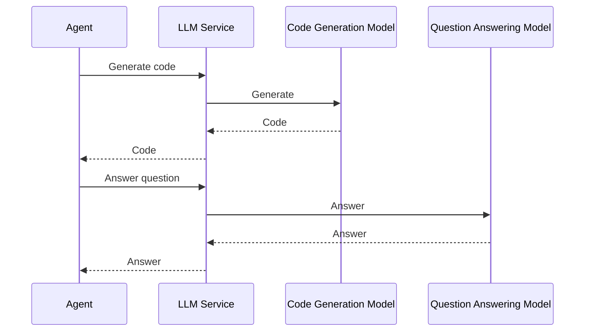

```mermaid
sequenceDiagram
    participant Agent
    participant LLMService as LLM Service
    participant CodeGenModel as Code Generation Model
    participant QAModel as Question Answering Model

    Agent->>LLMService: Generate code
    LLMService->>CodeGenModel: Generate
    CodeGenModel-->>LLMService: Code
    LLMService-->>Agent: Code

    Agent->>LLMService: Answer question
    LLMService->>QAModel: Answer
    QAModel-->>LLMService: Answer
    LLMService-->>Agent: Answer
```
