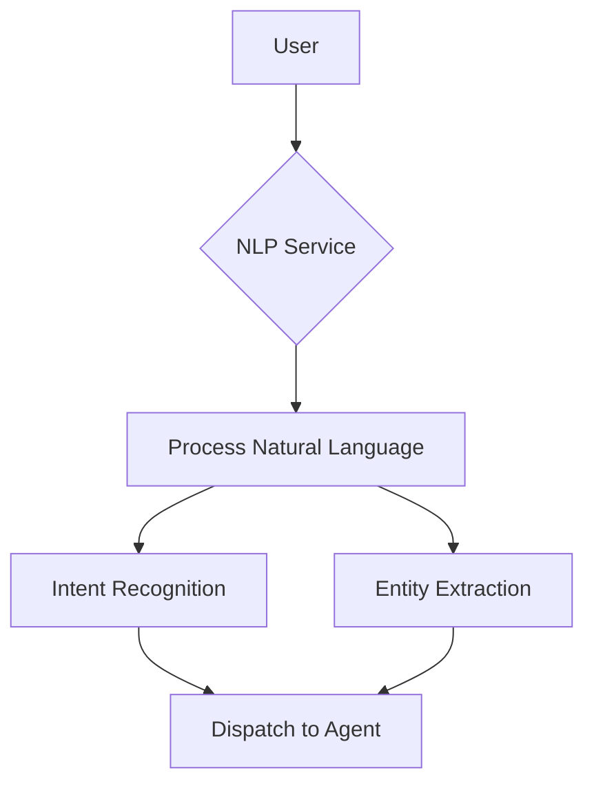

```mermaid
graph TD
    A[User] --> B{NLP Service};
    B --> C[Process Natural Language];
    C --> D[Intent Recognition];
    C --> E[Entity Extraction];
    D --> F[Dispatch to Agent];
    E --> F;
```
